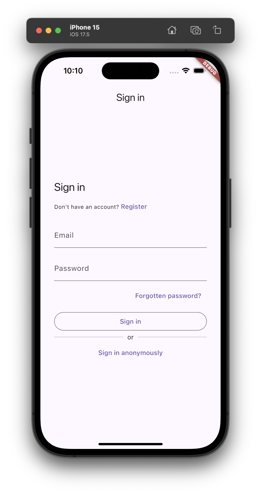
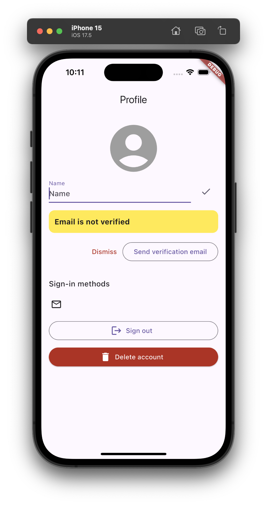

# flutter_mock_firebase_auth

> [!WARNING]  
> This example app does not yet correctly implement the intended behavior of logging in a test user to a Flutter app and having the app display the correct post-login page. More details below.

This app is intended to illustrate how to implement an integration test based on:
* [riverpod](https://pub.dev/packages/flutter_riverpod) (to enable overriding of FirebaseAuth and AuthRepository instances with mocks during testing).
* [firebase_ui_auth](https://pub.dev/packages/firebase_ui_auth) (to implement the signin and profile screens)
* [firebase_auth_mocks](https://pub.dev/packages/firebase_auth_mocks) (to mock the FirebaseAuth and AuthRepository instances).
* [patrol_finders](https://pub.dev/packages/patrol_finders) (to simplify tests to check what screen is displayed during the integration test.

## Installation

First, go to the Firebase console and:

* Create a new project, perhaps called "flutter-mock-firebase-auth". You can disable Google Analytics, you won't need them for this app.

* Enable Firebase Authentication, along with the Email/Password Authentication Sign-in provider in the Firebase Console (Authentication > Sign-in method > Email/Password > Edit > Enable > Save)

* You do NOT need to create a database; this example app only uses Firebase Authentication.

Then, in the terminal:

* Run `firebase login` so you have access to the Firebase project you have created.

* Run `flutterfire configure` and follow all the steps. Note you should say "no" to the first prompt in order to allow you to connect the app to  your newly created Firebase project.

Finally, invoke:

```
pub get
```

and your favorite flavor of

```
flutter run
```

What should appear is the SignIn screen:



Click to register a new user. Once you've gone through that process, you should see the  Profile screen:



When you can register and signin and see the Profile screen, you have verified that the app is working correctly. 

This app contains only a SignIn and Profile screen, because the goal of this app is to explore how to mock Firebase Authentication. 

The goal of this app is to illustrate how to do integration testing such that we can mock the signin process and get to the Profile screen without actually accessing the Firebase Authentication server.

## Run the integration tests

### Integration test for signin workflow

To run an integration test that steps through the signin and authentication workflow, invoke:

```
flutter test integration_test/app_test.dart
```

Here's the code for [app_test.dart](https://github.com/philipmjohnson/flutter_mock_firebase_auth/blob/main/integration_test/app_test.dart).

We would like it to produce output similar to:
```
00:17 +0: ... /Users/philipjohnson/GitHub/philipmjohnson/flutter_mock_firebase_auth/integration_test/app_test.dart              
Ru00:39 +0: ... /Users/philipjohnson/GitHub/philipmjohnson/flutter_mock_firebase_auth/integration_test/app_test.dart               
00:43 +0: ... /Users/philipjohnson/GitHub/philipmjohnson/flutter_mock_firebase_auth/integration_test/app_test.dart           4.1s
Xcode build done.                                           26.2s
00:46 +1: All tests passed!       
```

But it does not due to issues with the firebase_auth_mocks package which are reported [here](https://github.com/atn832/firebase_auth_mocks/issues/114).

### Integration test where authenticated user is defined prior to test

All is not lost, however. If you define an authenticated user prior to starting the integration test, then the app behaves as if the user was already signed in, the first screen displays the Profile page, and you can continue testing from there.

This approach is illustrated in [app_test2.dart](https://github.com/philipmjohnson/flutter_mock_firebase_auth/blob/main/integration_test/app_test2.dart).